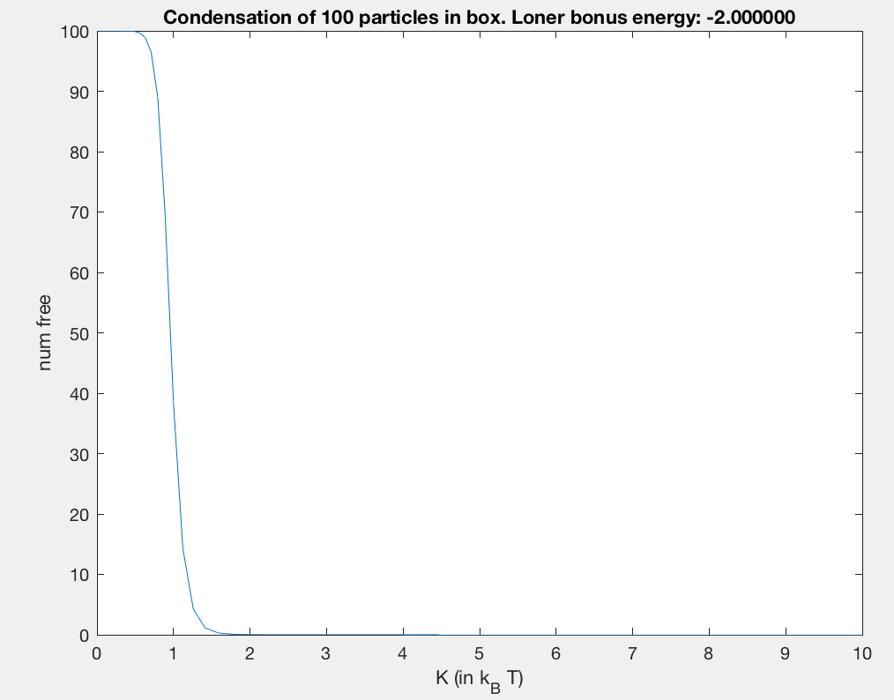
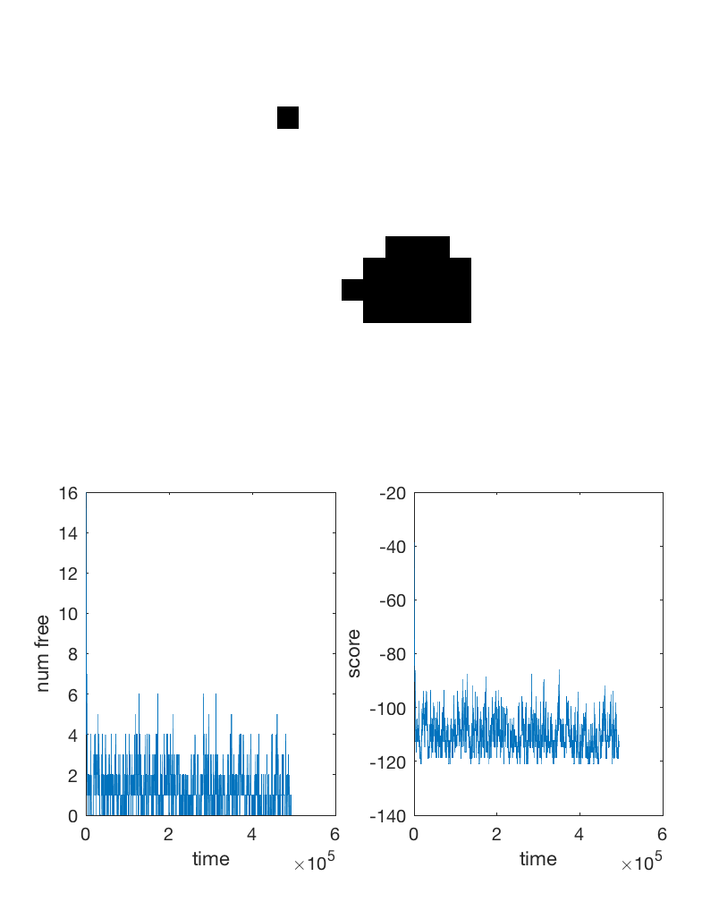
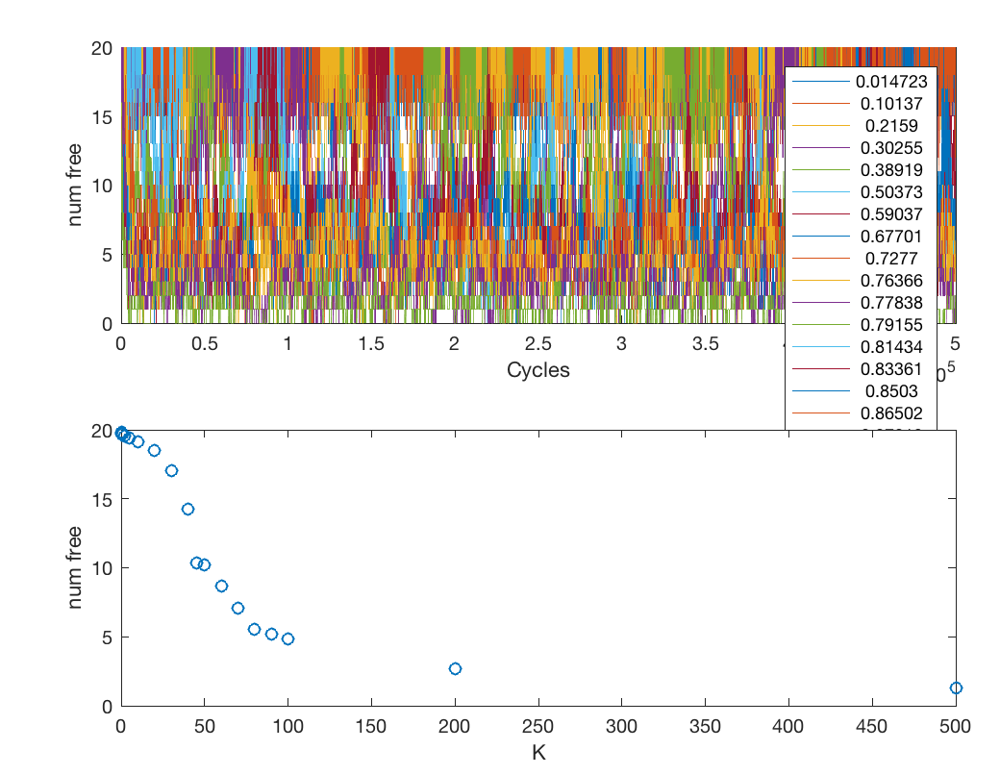
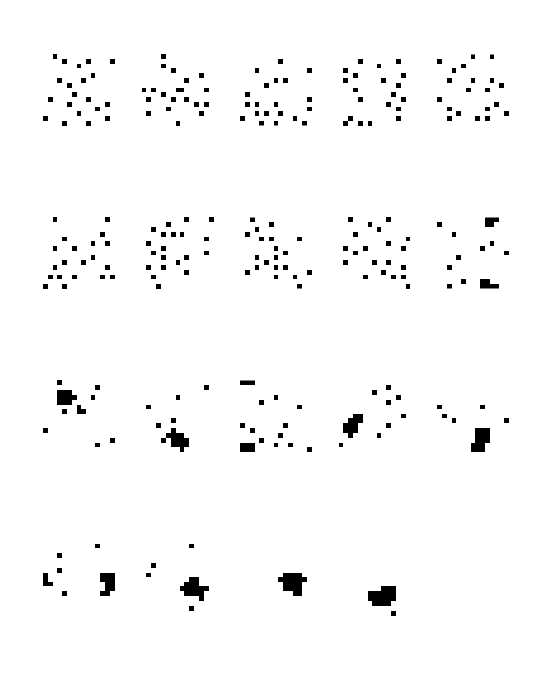

# Simulations of biomolecule condensation for Stanford BIOC/BIOP/SBIO/BIOE 241
(C) R. Das, Stanford University 2019

## What this is
This is a tiny sandbox for quickly modeling condensation of particles in a box to illustrate and 
understand some cool basic behaviors of biomolecular condensation:
* Ultrasensitivity 
* Buffering [_to do_]

You need MATLAB to run it.

## How to run it
There are a couple of useful tools in here...
### simple_landscape_analysis
This computes the number of particles that remain free (vs. in a condensate) just assuming a simple model where:
* free particles (but not multimers) get a special `loner_energy` bonus (-2.0 kT)
* particles going into larger and larger multimers get a probability weight proportional to `K^n` where K is 
    like an equilibrium constant for going into the condensate and n is the multimer stoichiometry.

If you just type at MATLAB
```
>> simple_landscape_analysis
```

You'll see a sharp transition as K increases, when the total number of particles is N = 100:



You can see a less sharp transition if N is reduced to 20 (check out alternative parameters in `simple_landscape_analysis.m`)


### simulate_box
Actually simulate the grid of particles.

Just type in MATLAB
```
>> simulate_box
```

The default parameters simulate a 15x15 box, increasing the bond strength. 
Completing all 19 simulations takes about 10 minutes on a MacBook Pro (2.9GHz, i7). 

Figure 1 show snapshots of the simulations as they are running.



After completion, 
* Figure 1 shows the snapshot of the last simluation (which should be totally condensed)
* Figure 2 shows a scan of num_free with increasing bond strength. Should see a reasonably sharp transition:

* Figure 3 shows snapshots of all the different simulatios with increasing bond strength:

* Figure 4 is used to make a movie for K = 20.  [Check the code for how to get other movies]

